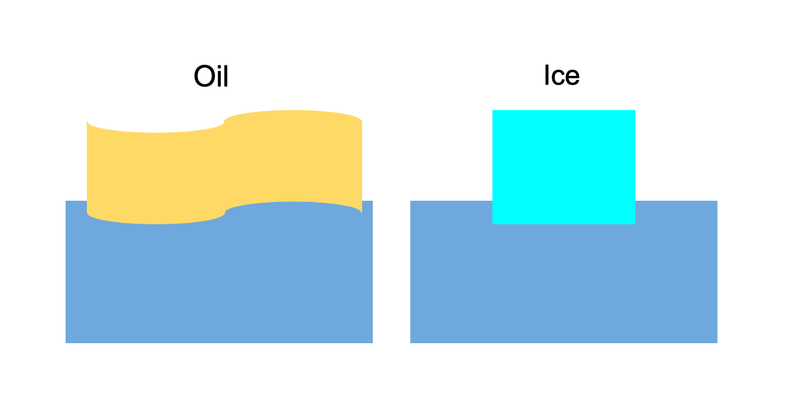
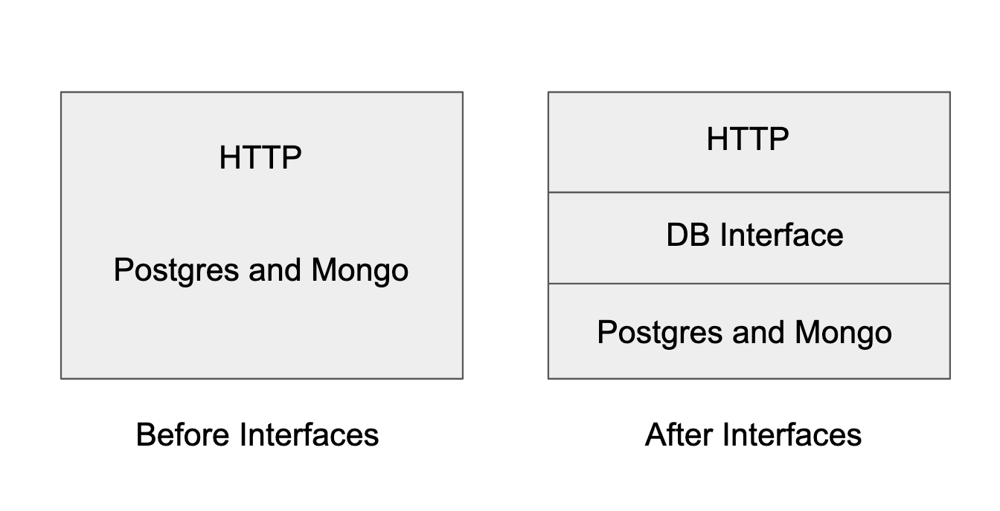

## Intro 

It is a general phenomenon among humans (I mean our brain) to not notice things which are similar. You might understand this article better if you start looking at things a different way.

I come from a Java background. I've used them only for competitive programing when I was in my university, so I had no idea what interfaces were, although Java supported them. I always confused them with classes and it kept me up at night. I just couldn't understand what the heck they were!

I'll try my best to explain what interfaces in Go are, assuming you're five years old.


Let's take an example of two things that float on water, oil and ice.



Why do they float on water? You would probably say the following.

* Both of them are less dense compared to water.

This means both of them satisfy the same condition. So let's say `floatable` is the requirement or the condition for a material in order to float on water. 

Now let's understand this in terms of Go where we simulate the oil and ice example.

Cambridge Dictionary defines interface as "to communicate between two things and affect each other."

`FloatableEntity` defines an interface and then we have our condition `floatable` that is to be satisfied. 

```go
type FloatableEntity interface {
    floatable() 
}
```

Now oil and ice might have different properties like BP, viscocity etc.

```go
type Oil struct {
    BoilingPoint int
    Viscosity int
}

type Ice struct {
    MeltingPoint int
    Color string
}
```

But unless both of them have a `floatable` signature, they don't implement `FloatableEntity`

```go
func(o Oil) floatable() {
    fmt.Println("I'm oil. My BP is", o.BoilingPoint, " and I float on water!")
}

func(i Ice) floatable() {
    fmt.Println("I'm ice. My color is", i.Color, "and I too float on water like oil!")
}
```

Well, this is not a topic of conversation for me with a five year old but I hope you understood what interfaces are. Let's see how they're used in writing web apps.

## **Practical usage of interfaces**

When a client at work says "We need an application which can take user's sign up data and then store it in a database", he doesn't specify what database he needs for e.g. Mongo or Postgres. All he needs, is his user information stored somewhere. 

**So according to him, if an entity stores something like a database, retrieves it like a database, and lets him edit it like a database, it is a database.**

Let's say you're dealing with two kinds of databases. You have some user information which you obtain from your HTTP handler, and then you try to store it in both MongoDB and PostgreSQL. Typically if one didn't know about interfaces, they would do the following.

We have the User struct as follows:

```go
type User struct {
    FirstName string
    LastName string
    DOB string
    // etc..
}
```

and then our total program would look like this when we add our HTTP handler:

```go
func main() {
    r := mux.NewRouter()
    r.HandleFunc("/user", UserHandler)
    log.Fatal(http.ListenAndServe(":8000", r))
}

func UserHandler(w http.ResponseWriter, r *http.Request)  {
    var u User
    if err := json.NewDecoder(r.Body).Decode(&u); err != nil {
    	// handle error
    	return
    }

    // Postgres Insertion
    postgresDB := pg.Connect(&pg.Options{})
    _, err := postgresDB.Model(&User{}).Insert(u)

    if err != nil {
    	// handle error
    	return
    }

    // Mongo Insertion
    client, _ := mongo.NewClient(options.Client().ApplyURI("uri"))
    _, err = client.Database("sample").
    	Collection("users").
    	InsertOne(context.Background(), u)

    if err != nil {
    	// handle error
    	return
    }
}

type User struct {
	FirstName string
	LastName string
	DOB string
	// etc..
}
```

For the sake of this article, I didn't intend to initialize a singleton for DB connections since our main focus is on interfaces. I'm using [go-pg](https://github.com/go-pg/pg) and [mongo-go-driver](https://github.com/mongodb/mongo-go-driver) and [mux](https://github.com/gorilla/mux) as my dependencies.

## Enter interfaces into our app 

If we take a look at our application, we know the following regarding the same:

* Both of our database perform the same functionality `insert` which is analogous to `floatable` in the oil and ice example.
* We create a `DB` interface and implement `insert` on both Mongo and PostgreSQL to satisfy the interface condition.

Our `DB` interface looks like this with an `Insert` method which inserts a user into the database:

```go
type DB interface {
    Insert(user User) error
}

func InsertIntoDB(db DB, user User)  {
    err := db.Insert(user)
    if err != nil {
    	fmt.Println(err)
    }
}
```

And now we declare our PostgreSQL and Mongo database objects:

```go
type PostgresDBObject struct {
    db *pg.DB
}

func (p PostgresDBObject) Insert(user User) error {
    _, err := p.db.Model(&user).Insert(user)

    if err != nil {
    	return err
    }

    return nil
}

type MongoDBObject struct {
    client *mongo.Client
}

func (m MongoDBObject) Insert(user User) error {
    c := m.client.Database("sample").Collection("users")
    _, err := c.InsertOne(context.Background(), user)

    if err != nil {
    	return err
    }

    return nil
}
```

Now this is how our handler would look:

```go
func UserHandler(w http.ResponseWriter, r *http.Request)  {
    var u User
    if err := json.NewDecoder(r.Body).Decode(&u); err != nil {
    	// handle error
    	return
    }

    var db DB

    db = PostgresDBObject{
		db: pg.Connect(&pg.Options{}),
	}

    // Inserts into PostgreSQL because db contains a postgres connection
    InsertIntoDB(db, user)
    
    client, _ := mongo.NewClient(options.Client().ApplyURI("uri"))
	db = MongoDBObject{
		client: client,
	}

    // Inserts into MongoDB because db contains a Mongo client
	InsertIntoDB(db, user)
}
```

If we want to make it more simpler, we could have an array of `DB` interfaces and add a pinch of concurrency by just adding `go` to `InsertIntoDB` since dealing with PostgreSQL and MongoDB are independent operations.

```go
func UserHandler(w http.ResponseWriter, r *http.Request)  {
    var u User
    if err := json.NewDecoder(r.Body).Decode(&u); err != nil {
    	// handle error
    	return
    }

    client, _ := mongo.NewClient(options.Client().ApplyURI("uri"))

    var dbs []DB

    dbs = append(dbs, PostgresDBObject{
        db: pg.Connect(&pg.Options{}),
    }, MongoDBObject{
        client: client,
    })

    for _, db := range dbs {
        go InsertIntoDB(db, user)
    }
}
```

If you closely observe, we removed direct interaction between the HTTP handler and the database connections i.e decoupling the API layer and the data layer.



## When to use interfaces

* You need just the right amount of interfaces in your code. You do not want to overdo it, and you do not want to write similar pieces of code again and again either.

* Use interfaces only when you need them. In the example we've mentioned above, if we had used interfaces if we're dealing with either of PostgreSQL or Mongo but not both, our codebase would seem very confusing.

* Collaboration is essential between developers when using interfaces. If additional methods are added to existing interfaces, other code might break because your version hasn't still implemented those functions.

* For testing purposes. Interfaces are used in testing to mock/fake database connections and functionality by implemented required functions.

* Passing interfaces to functions can be a ton of help. But it can bite you in the worst situations sometimes and can lead to runtime bugs. Golang is a statically typed language unlike JS and when interfaces are blindly passed without proper debugging, compile time errors aren't likely to occur because all the benefits of "statically typed" aren't in your court anymore.

Checkout this [list of all Go interfaces](https://sweetohm.net/article/go-interfaces.en.html) to know more about interfaces in the Go standard library.

## Examples of practical interfaces

* A word count utility as described here by [u/dyoo](https://www.reddit.com/user/dyoo/)

<a class="embedly-card" href="https://www.reddit.com/r/golang/comments/2dsof3/ask_golang_when_and_where_to_use_interfaces/cjsyyj2">Card</a>
<script async src="//embed.redditmedia.com/widgets/platform.js" charset="UTF-8"></script>

* This comment in the same thread gives a really good context about how interfaces are used.

<a class="embedly-card" href="https://www.reddit.com/r/golang/comments/2dsof3/ask_golang_when_and_where_to_use_interfaces/cjspiit">Card</a>
<script async src="//embed.redditmedia.com/widgets/platform.js" charset="UTF-8"></script>

* A program to `send` a piece of information like OTP, to both a user's mobile number and his email account.

## Conclusion
I hopefully transferred enough knowledge to you wonderful people about interfaces in Go. Let me know more about what I missed, and I will make sure to update this post so that you understand better. Afterall, all of us get to learn!